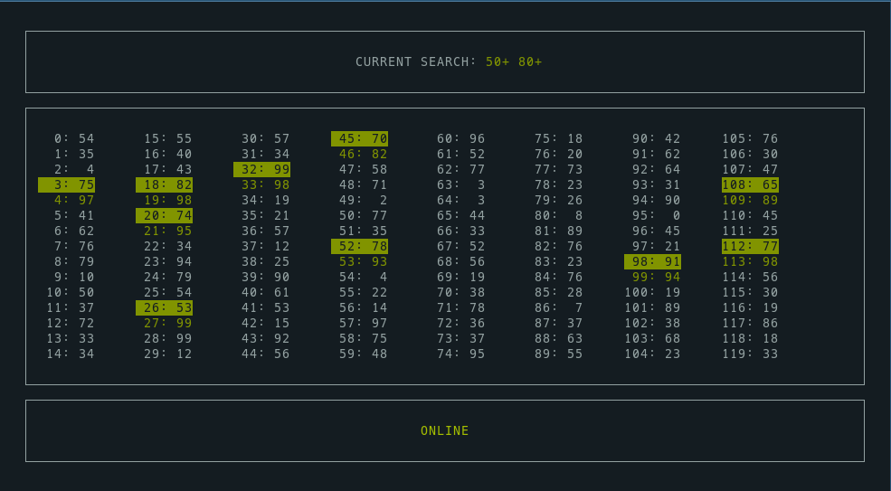

LinuxFF12RNGHelper
===================

This is a simple, terminal based UI to peek into the RNG of Final
Fantasy XII: The Zodiac Age (PC Steam version).

The RNG is responsible for the loot obtained from chests, drops,
mob steals, damage output, treasure spawns, and more.

Being able to watch it in real time helps mainly with looting chests,
since you can advance the RNG in a controlled manner until the sequence
you need for the chest loot is in place. In order to produce outputs in
battle, just reading the RNG isn't generally helpful and the RNG must
be manipulated (written to) as well.

This tool can only read the current RNG state, it won't write into it.

It is designed to use Linux's `procfs` to read the game's memory,
providing an alternative to the already available .NET based tools
for Windows:

- [FF12RNGHelperPC](https://github.com/Tranquilite0/FF12RNGHelperPC/)
- [FF12PCRNGHelper](https://github.com/mztikk/FF12PCRNGHelper)

Credits to both projects since they were useful to figure out how to
read the RNG state of the FFXII_TZA process.

The main use case for this tool is for people (me) playing the game
under [Wine](https://www.winehq.org/), since there is not a Linux
version of this excellent game.

Installation
------------

### Source:

- Become root (`su` or `sudo su`)
- Create a virtual environment (`python3 -m venv .venv`)
- Activate it (`source .venv/bin/activate`)
- Install dependencies using [Poetry](https://python-poetry.org/):
  `poetry install`
- Run with `# linuxff12rnghelper ui`

### Binary:

Just run:

```
# ./linuxff12rnghelper ui
```

Note that you must run the tool as root since it needs permission to
read a different process' memory.

The binary executable was created with [Nuitka](https://nuitka.net/).
If it doesn't work for you, try running using the source.

Usage
-----

Just run it and check the RNG, you shouldn't need to do anything other than
enter a search pattern if you want to.

It will produce a log file in the directory it's run from, `linuxff12rnghelper.log`.

Here's a screenshot:



The bottom pane should display online if the game is open and the tool can
read its memory.

The center pane displays columns with the next percentage values from the
RNG. The current value is that in position "0". At most 1000 values will
show, depending on terminal size.

The top pane is where you can enter a search pattern. Use `s` or `/` to enter
edit mode, `q` or `ESC` to exit without saving changes, and `ENTER` to confirm
the new search pattern. If the pattern is found at least once in the next 1000
percentage values, it will display in green and matches will be highlighted.
Otherwise, the pattern will display in red.

Patterns can contain modifiers (`+` and `-`). A pattern of `50+` matches
all values equal or above 50. `50-` matches values equal or below 50.
Values range from 0 to 99, so to spawn a 1% chest like Zodiac Spear, you
need the corresponding slot to be set to 0, and to loot a 1% rare item
from a chest (is there any? not sure if the Seitengrat has such low chance
or if it was a bit higher...) you'd have to get a 99 in the corresponding slot.

Some chests with high end gear like those in the Cerobi Steppe have descriptions
like these:

> 10% chance to appear, 80% chance for gil, 5% chance the item treasure is
> the Grand Armor with the Diamond Armlet equipped

So once you get the chest to spawn, you'd need to look for a pattern like:

```
80+ 95+
```

Once the pattern reaches position 0 just before looting, and assuming you
have the Diamond Armlet equipped, you'd get the item.

---

If the colorscheme sucks for your term settings, sorry, haven't got around to
implementing any customization. You can tweat `TUI._init_colors` in file
`tui.py` if you're running from source.

Press `q` or `CTRL+C` to exit the tool.
